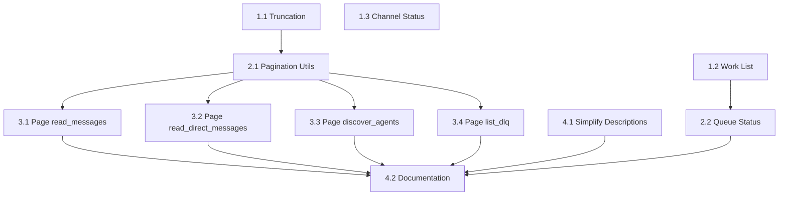
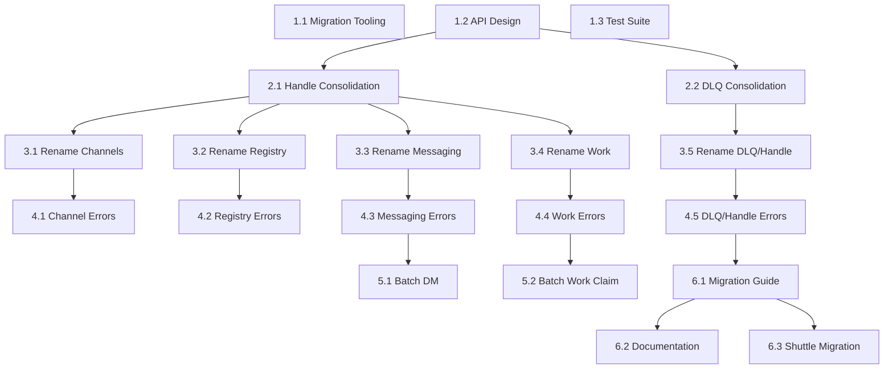

# Warp Improvement Implementation Plan

**Date**: 2025-12-22
**Current Version**: 0.3.0 (Beta)
**Target Versions**: 0.4.0 (Q1 2026), 2.0.0 (Q2 2026)
**Status**: Planning Phase

---

## Executive Summary

This plan addresses critical issues identified in `CRITICAL_REASSESSMENT.md` while maintaining compatibility with Shuttle (active dependency). The strategy uses a **two-phase approach**:

- **v0.4.0 (Non-Breaking)**: Fill workflow gaps, add optimizations - ships alongside Shuttle v1
- **v2.0.0 (Breaking)**: Full Anthropic compliance, tool consolidation, prefixed naming

**Key Constraint**: Shuttle is in active development (Phase 1 complete, Phase 2-3 upcoming). Breaking changes require coordination.

---

## Complexity Assessment

**Classification**: **Complex** (8 systems affected, 17 tools modified)

### Systems Affected

1. **Tool Naming** (17 tools) - Prefix addition
2. **Handle Management** (2 tools) - Consolidation
3. **DLQ Management** (3 tools) - Consolidation
4. **Work Queue** (2 tools + 1 new) - Add preview/status capabilities
5. **Channels** (3 tools + 1 new) - Add status endpoint
6. **Pagination** (4 tools) - Add cursor support
7. **Truncation** (4 tools) - Add metadata
8. **Error Handling** (17 tools) - Exception-based errors

### Dependencies

**Requires before starting**:
- Shuttle Phase 1 stable (✅ Complete)
- NATS JetStream operational (✅ Current)
- MCP SDK @1.0.4+ (✅ Current)

**External coordination**:
- Shuttle team (for v2.0 breaking changes)
- Pattern team (tool naming alignment)
- Documentation updates

### Assumptions

1. Shuttle v1 will tolerate non-breaking additions (v0.4.0)
2. Shuttle v2 development window available Q2 2026 for breaking changes
3. Current test coverage (~70%) adequate for refactoring
4. NATS infrastructure stable (no migration needed)
5. Migration period: 4-6 weeks for v2.0 adoption

### Risks & Mitigation

| Risk | Impact | Mitigation |
|------|--------|------------|
| Shuttle breaks on v0.4.0 additions | High | Extensive integration testing, early Shuttle notification |
| v2.0 migration takes >6 weeks | Medium | Provide compatibility shim, extend support window |
| Tool name conflicts with other MCPs | Low | Survey ecosystem, reserve `warp_*` namespace |
| Performance regression from pagination | Medium | Benchmark before/after, optimize cursor implementation |

---

## Two-Phase Strategy

### Phase Split Rationale

**Why v0.4.0 First?**
1. **Immediate value**: Shuttle benefits from work preview and status tools NOW
2. **Risk reduction**: Test complex features (pagination, truncation) before breaking changes
3. **Real-world data**: Gather usage metrics to inform v2.0 design
4. **Shuttle coordination**: Allows Shuttle v1 to ship without waiting for breaking changes

**Why v2.0 Later?**
1. **Breaking changes**: Tool renames require all dependents to update
2. **Consolidation**: Handle/DLQ merges need careful API design
3. **Migration complexity**: Need comprehensive migration guide and tooling
4. **Shuttle v2**: Coordinate with Shuttle's next major version

---

## v0.4.0: Non-Breaking Enhancements

**Target**: Q1 2026 (8-10 weeks)
**Effort**: ~120 hours across 3-4 developers
**Value**: High (fills critical workflow gaps)

### Batch Execution Plan

#### Batch 1: Foundation (Parallel - 3 agents)

**Phase 1.1: Add Truncation Metadata to Responses**
- **Effort**: S
- **Files**: `src/tools/channels.ts`, `src/tools/registry.ts`, `src/tools/dlq.ts`
- **Tasks**:
  - [ ] Add `TruncationMetadata` interface to shared types
  - [ ] Update `read_messages` to include truncation info
  - [ ] Update `discover_agents` to include truncation info
  - [ ] Update `list_dead_letter_items` to include truncation info
  - [ ] Add unit tests for truncation metadata
- **Done When**: All list operations return `{showing, total, truncated, suggestion}`
- **Depends On**: None
- **Breaking**: No (additive)

**Phase 1.2: Add warp_work_list Tool**
- **Effort**: M
- **Files**: `src/tools/work-queue-list.ts`, `src/tools/index.ts`, `src/workqueue.ts`
- **Tasks**:
  - [ ] Create new tool handler `warp_work_list`
  - [ ] Implement NATS stream consumer for work preview (non-destructive)
  - [ ] Add filtering by capability, priority, deadline
  - [ ] Return work items without claiming
  - [ ] Add unit tests
  - [ ] Update integration tests
- **Done When**: Agents can preview available work without claiming
- **Depends On**: None
- **Breaking**: No (new tool)

**Phase 1.3: Add warp_channels_status Tool**
- **Effort**: S
- **Files**: `src/tools/channels-status.ts`, `src/tools/index.ts`
- **Tasks**:
  - [ ] Create tool handler `warp_channels_status`
  - [ ] Query NATS stream info for message count
  - [ ] Return channel metadata without reading messages
  - [ ] Add unit tests
- **Done When**: Agents can check message counts without consuming tokens
- **Depends On**: None
- **Breaking**: No (new tool)

---

#### Batch 2: Pagination Infrastructure (After Batch 1 - 2 agents)

**Phase 2.1: Implement Cursor-Based Pagination System**
- **Effort**: M
- **Files**: `src/pagination.ts`, `src/types.ts`
- **Tasks**:
  - [ ] Create `PaginationCursor` type (base64-encoded state)
  - [ ] Create `PaginationMetadata` interface
  - [ ] Implement cursor encoding/decoding utilities
  - [ ] Add cursor validation logic
  - [ ] Add unit tests for pagination utilities
- **Done When**: Pagination utilities functional and tested
- **Depends On**: Phase 1.1 (builds on truncation metadata)
- **Breaking**: No (internal utilities)

**Phase 2.2: Add warp_work_queue_status Tool**
- **Effort**: S
- **Files**: `src/tools/work-queue-status.ts`, `src/tools/index.ts`
- **Tasks**:
  - [ ] Create tool handler `warp_work_queue_status`
  - [ ] Query NATS stream for queue depth per capability
  - [ ] Calculate claim rate metrics (optional)
  - [ ] Add unit tests
- **Done When**: Agents can monitor queue health
- **Depends On**: Phase 1.2 (uses similar NATS queries)
- **Breaking**: No (new tool)

---

#### Batch 3: Apply Pagination (After Batch 2 - 4 agents)

**Phase 3.1: Add Pagination to read_messages**
- **Effort**: S
- **Files**: `src/tools/channels.ts`
- **Tasks**:
  - [ ] Add optional `cursor` parameter
  - [ ] Return `PaginationMetadata` with `nextCursor`
  - [ ] Update tests for paginated reading
- **Done When**: Channel messages support pagination
- **Depends On**: Phase 2.1
- **Breaking**: No (optional parameter)

**Phase 3.2: Add Pagination to read_direct_messages**
- **Effort**: S
- **Files**: `src/tools/messaging.ts`
- **Tasks**:
  - [ ] Add optional `cursor` parameter
  - [ ] Return `PaginationMetadata` with `nextCursor`
  - [ ] Update tests
- **Done When**: Direct messages support pagination
- **Depends On**: Phase 2.1
- **Breaking**: No (optional parameter)

**Phase 3.3: Add Pagination to discover_agents**
- **Effort**: S
- **Files**: `src/tools/registry.ts`
- **Tasks**:
  - [ ] Add optional `cursor` parameter
  - [ ] Return `PaginationMetadata`
  - [ ] Update tests
- **Done When**: Agent discovery supports pagination
- **Depends On**: Phase 2.1
- **Breaking**: No (optional parameter)

**Phase 3.4: Add Pagination to list_dead_letter_items**
- **Effort**: S
- **Files**: `src/tools/dlq.ts`
- **Tasks**:
  - [ ] Add optional `cursor` parameter
  - [ ] Return `PaginationMetadata`
  - [ ] Update tests
- **Done When**: DLQ listing supports pagination
- **Depends On**: Phase 2.1
- **Breaking**: No (optional parameter)

---

#### Batch 4: Documentation & Polish (After Batch 3 - 2 agents)

**Phase 4.1: Simplify Tool Descriptions**
- **Effort**: S
- **Files**: All tool files (17 tools)
- **Tasks**:
  - [ ] Remove NATS implementation details from descriptions
  - [ ] Use task-focused language ("what" not "how")
  - [ ] Abstract "JetStream" → "reliable messaging"
  - [ ] Abstract "competing consumers" → "distributed to available agents"
  - [ ] Review all 17 tool descriptions for clarity
- **Done When**: Descriptions accessible to agents without NATS knowledge
- **Depends On**: None (documentation only)
- **Breaking**: No (documentation)

**Phase 4.2: Update Documentation for New Tools**
- **Effort**: S
- **Files**: `README.md`, `docs/tools.md`, examples
- **Tasks**:
  - [ ] Document `warp_work_list` usage
  - [ ] Document `warp_channels_status` usage
  - [ ] Document `warp_work_queue_status` usage
  - [ ] Add pagination examples
  - [ ] Add truncation metadata examples
  - [ ] Update tool count (17 → 20 tools)
- **Done When**: All new features documented with examples
- **Depends On**: Phases 1.2, 1.3, 2.2, 3.1-3.4
- **Breaking**: No (documentation)

---

### v0.4.0 Summary

**Total Phases**: 10
**Batches**: 4
**Estimated Timeline**: 8-10 weeks
**Parallelization**: Up to 4 agents per batch

**New Tools**: 3
- `warp_work_list` (preview work before claiming)
- `warp_channels_status` (message counts without reading)
- `warp_work_queue_status` (queue monitoring)

**Enhancements**:
- Truncation metadata on all list operations
- Cursor-based pagination on 4 tools
- Simplified, agent-friendly descriptions

**Impact on Shuttle**: ✅ **Compatible** - All changes are additive

---

## v2.0.0: Breaking Changes & Full Compliance

**Target**: Q2 2026 (12-16 weeks)
**Effort**: ~180 hours across 4-5 developers
**Value**: Very High (full Anthropic compliance)

### Batch Execution Plan

#### Batch 1: Preparation & Tooling (Parallel - 3 agents)

**Phase 1.1: Create Migration Tooling**
- **Effort**: M
- **Files**: `scripts/migrate-to-v2.ts`, `scripts/check-compatibility.ts`
- **Tasks**:
  - [ ] Create tool name migration script (old → new names)
  - [ ] Create compatibility checker for codebases
  - [ ] Generate migration report (which tools used, impact)
  - [ ] Add CLI for migration automation
- **Done When**: Dependents can auto-migrate tool names
- **Depends On**: None
- **Breaking**: No (tooling)

**Phase 1.2: Design Consolidated Tool APIs**
- **Effort**: M
- **Files**: `docs/v2-api-design.md`
- **Tasks**:
  - [ ] Design `warp_handle` consolidated API (get/set)
  - [ ] Design `warp_dlq_manage` consolidated API (operation enum)
  - [ ] Define input schemas with backward compat considerations
  - [ ] Review with stakeholders (Shuttle team)
  - [ ] Document migration path for each tool
- **Done When**: API designs approved and documented
- **Depends On**: None
- **Breaking**: No (design only)

**Phase 1.3: Update Test Suite for v2.0**
- **Effort**: M
- **Files**: All test files
- **Tasks**:
  - [ ] Create v2 test fixtures with new tool names
  - [ ] Add tests for consolidated tools
  - [ ] Add tests for exception-based errors
  - [ ] Ensure 80%+ coverage maintained
- **Done When**: Test suite ready for v2.0 validation
- **Depends On**: Phase 1.2 (API designs)
- **Breaking**: No (tests)

---

#### Batch 2: Tool Consolidation (After Batch 1 - 2 agents)

**Phase 2.1: Consolidate Handle Tools**
- **Effort**: M
- **Files**: `src/tools/handle.ts`
- **Tasks**:
  - [ ] Create unified `warp_handle` tool
  - [ ] If `handle` param provided → set, else → get
  - [ ] Maintain backward compat internally
  - [ ] Add deprecation warnings for old tools
  - [ ] Update tests
- **Done When**: Single tool replaces `set_handle` + `get_my_handle`
- **Depends On**: Phase 1.2
- **Breaking**: Yes (removes 2 tools)

**Phase 2.2: Consolidate DLQ Tools**
- **Effort**: M
- **Files**: `src/tools/dlq.ts`
- **Tasks**:
  - [ ] Create unified `warp_dlq_manage` tool
  - [ ] Add `operation` enum: list, retry, discard
  - [ ] Consolidate logic from 3 tools
  - [ ] Add operation-specific validation
  - [ ] Update tests
- **Done When**: Single tool replaces 3 DLQ tools
- **Depends On**: Phase 1.2
- **Breaking**: Yes (removes 3 tools)

---

#### Batch 3: Tool Renaming (After Batch 2 - 5 agents in parallel)

**Phase 3.1: Rename Channel Tools**
- **Effort**: S
- **Files**: `src/tools/channels.ts`, `src/tools/index.ts`
- **Tasks**:
  - [ ] Rename `list_channels` → `warp_channels_list`
  - [ ] Rename `send_message` → `warp_channels_send`
  - [ ] Rename `read_messages` → `warp_channels_read`
  - [ ] Update tool exports
  - [ ] Update tests
- **Done When**: All channel tools prefixed with `warp_channels_*`
- **Depends On**: Phase 2.1, 2.2 (consolidation complete)
- **Breaking**: Yes (renames 3 tools)

**Phase 3.2: Rename Registry Tools**
- **Effort**: S
- **Files**: `src/tools/registry.ts`, `src/tools/index.ts`
- **Tasks**:
  - [ ] Rename `register_agent` → `warp_registry_register`
  - [ ] Rename `discover_agents` → `warp_registry_discover`
  - [ ] Rename `get_agent_info` → `warp_registry_get_info`
  - [ ] Rename `update_presence` → `warp_registry_update_presence`
  - [ ] Rename `deregister_agent` → `warp_registry_deregister`
  - [ ] Update tests
- **Done When**: All registry tools prefixed with `warp_registry_*`
- **Depends On**: Phase 2.1, 2.2
- **Breaking**: Yes (renames 5 tools)

**Phase 3.3: Rename Messaging Tools**
- **Effort**: S
- **Files**: `src/tools/messaging.ts`, `src/tools/index.ts`
- **Tasks**:
  - [ ] Rename `send_direct_message` → `warp_messages_send_direct`
  - [ ] Rename `read_direct_messages` → `warp_messages_read_direct`
  - [ ] Update tests
- **Done When**: All messaging tools prefixed with `warp_messages_*`
- **Depends On**: Phase 2.1, 2.2
- **Breaking**: Yes (renames 2 tools)

**Phase 3.4: Rename Work Queue Tools**
- **Effort**: S
- **Files**: `src/tools/work-queue.ts`, `src/tools/index.ts`
- **Tasks**:
  - [ ] Rename `broadcast_work_offer` → `warp_work_broadcast`
  - [ ] Rename `claim_work` → `warp_work_claim`
  - [ ] Update tests
- **Done When**: All work tools prefixed with `warp_work_*`
- **Depends On**: Phase 2.1, 2.2
- **Breaking**: Yes (renames 2 tools)

**Phase 3.5: Update DLQ and Handle Tool Names**
- **Effort**: S
- **Files**: `src/tools/dlq.ts`, `src/tools/handle.ts`, `src/tools/index.ts`
- **Tasks**:
  - [ ] Ensure `warp_handle` name finalized
  - [ ] Ensure `warp_dlq_manage` name finalized
  - [ ] Update exports
  - [ ] Update tests
- **Done When**: All tools follow `warp_*` naming convention
- **Depends On**: Phase 2.1, 2.2
- **Breaking**: Yes (consolidated tools)

---

#### Batch 4: Error Handling Refactor (After Batch 3 - 5 agents in parallel)

**Phase 4.1: Refactor Channel Tools Error Handling**
- **Effort**: S
- **Files**: `src/tools/channels.ts`
- **Tasks**:
  - [ ] Replace `{isError: true}` with exceptions
  - [ ] Use standard Error classes
  - [ ] Update error messages
  - [ ] Update tests to expect exceptions
- **Done When**: Channel tools throw exceptions for errors
- **Depends On**: Phase 3.1
- **Breaking**: Yes (error handling change)

**Phase 4.2: Refactor Registry Tools Error Handling**
- **Effort**: S
- **Files**: `src/tools/registry.ts`
- **Tasks**:
  - [ ] Replace `{isError: true}` with exceptions
  - [ ] Use standard Error classes
  - [ ] Update tests
- **Done When**: Registry tools throw exceptions for errors
- **Depends On**: Phase 3.2
- **Breaking**: Yes (error handling change)

**Phase 4.3: Refactor Messaging Tools Error Handling**
- **Effort**: S
- **Files**: `src/tools/messaging.ts`
- **Tasks**:
  - [ ] Replace `{isError: true}` with exceptions
  - [ ] Update tests
- **Done When**: Messaging tools throw exceptions for errors
- **Depends On**: Phase 3.3
- **Breaking**: Yes (error handling change)

**Phase 4.4: Refactor Work Queue Tools Error Handling**
- **Effort**: S
- **Files**: `src/tools/work-queue.ts`
- **Tasks**:
  - [ ] Replace `{isError: true}` with exceptions
  - [ ] Update tests
- **Done When**: Work tools throw exceptions for errors
- **Depends On**: Phase 3.4
- **Breaking**: Yes (error handling change)

**Phase 4.5: Refactor DLQ and Handle Tools Error Handling**
- **Effort**: S
- **Files**: `src/tools/dlq.ts`, `src/tools/handle.ts`
- **Tasks**:
  - [ ] Replace `{isError: true}` with exceptions
  - [ ] Update tests
- **Done When**: All tools use exception-based error handling
- **Depends On**: Phase 3.5
- **Breaking**: Yes (error handling change)

---

#### Batch 5: Advanced Features (After Batch 4 - 2 agents)

**Phase 5.1: Add Batch Direct Message Tool**
- **Effort**: M
- **Files**: `src/tools/messaging-batch.ts`, `src/tools/index.ts`
- **Tasks**:
  - [ ] Create `warp_messages_send_bulk` tool
  - [ ] Accept array of {recipientGuid, message, metadata}
  - [ ] Implement batched NATS publish
  - [ ] Return success/failure per message
  - [ ] Add unit tests
- **Done When**: Agents can send bulk DMs efficiently
- **Depends On**: Phase 4.3 (messaging refactor)
- **Breaking**: No (new tool)

**Phase 5.2: Add Batch Work Claim Tool**
- **Effort**: M
- **Files**: `src/tools/work-queue-batch.ts`, `src/tools/index.ts`
- **Tasks**:
  - [ ] Create `warp_work_claim_batch` tool
  - [ ] Accept {capability, count}
  - [ ] Claim multiple work items in one call
  - [ ] Handle partial success (some claims fail)
  - [ ] Add unit tests
- **Done When**: Agents can claim multiple work items efficiently
- **Depends On**: Phase 4.4 (work queue refactor)
- **Breaking**: No (new tool)

---

#### Batch 6: Migration & Documentation (After Batch 5 - 3 agents)

**Phase 6.1: Create Migration Guide**
- **Effort**: M
- **Files**: `MIGRATION_v1_to_v2.md`, `docs/migration/`
- **Tasks**:
  - [ ] Document every tool name change (17 → 20 tools)
  - [ ] Document consolidated tool usage patterns
  - [ ] Document error handling changes
  - [ ] Provide code examples (before/after)
  - [ ] Add troubleshooting section
  - [ ] Create checklist for dependents
- **Done When**: Complete migration guide available
- **Depends On**: All Batch 4 phases
- **Breaking**: No (documentation)

**Phase 6.2: Update All Documentation for v2.0**
- **Effort**: M
- **Files**: `README.md`, `docs/*`, examples
- **Tasks**:
  - [ ] Update README with new tool names
  - [ ] Update all code examples
  - [ ] Update tool count (17 → 15 + 5 new = 20 total)
  - [ ] Add v2.0 changelog
  - [ ] Update architecture docs
- **Done When**: All docs reflect v2.0 API
- **Depends On**: Phase 6.1
- **Breaking**: No (documentation)

**Phase 6.3: Coordinate Shuttle v2 Migration**
- **Effort**: M
- **Files**: Shuttle repository
- **Tasks**:
  - [ ] Share migration guide with Shuttle team
  - [ ] Run migration script on Shuttle codebase
  - [ ] Update Shuttle tests for new tool names
  - [ ] Test Shuttle integration with Warp v2.0
  - [ ] Document any Shuttle-specific issues
- **Done When**: Shuttle v2 compatible with Warp v2.0
- **Depends On**: Phase 6.1
- **Breaking**: Yes (Shuttle dependency)

---

### v2.0.0 Summary

**Total Phases**: 18
**Batches**: 6
**Estimated Timeline**: 12-16 weeks
**Parallelization**: Up to 5 agents per batch

**Tool Changes**:
- **Removed**: 5 tools (2 handle + 3 DLQ consolidated)
- **Renamed**: 12 tools (all with `warp_*` prefix)
- **Added**: 5 tools (3 from v0.4.0 + 2 batch operations)
- **Total**: 20 tools (was 17)

**Breaking Changes**:
1. All tool names prefixed with `warp_*`
2. Handle tools consolidated → `warp_handle`
3. DLQ tools consolidated → `warp_dlq_manage`
4. Error handling: exceptions instead of `{isError: true}`

**Impact on Shuttle**: 🔴 **Breaking** - Requires Shuttle v2 coordination

---

## Critical Path Analysis

### v0.4.0 Critical Path (Longest Dependency Chain)

```
Phase 1.1 (Truncation) → Phase 2.1 (Pagination Utils) → Phase 3.1 (Pagination in read_messages) → Phase 4.2 (Documentation)
```

**Length**: 4 phases
**Estimated Time**: ~6 weeks (assuming 1.5 weeks per phase)

### v2.0.0 Critical Path

```
Phase 1.2 (API Design) → Phase 2.1 (Handle Consolidation) → Phase 3.1 (Channel Rename) → Phase 4.1 (Channel Error Refactor) → Phase 5.1 (Batch DM) → Phase 6.1 (Migration Guide) → Phase 6.3 (Shuttle Migration)
```

**Length**: 7 phases
**Estimated Time**: ~14 weeks (assuming 2 weeks per phase)

---

## Dependency Graph

### v0.4.0 Dependencies



### v2.0.0 Dependencies



---

## Success Criteria

### v0.4.0 Success Criteria

**Functional**:
- [ ] All 3 new tools implemented and tested
- [ ] Truncation metadata on all 4 list operations
- [ ] Pagination functional on 4 tools
- [ ] Shuttle integration unaffected (no breaking changes)

**Quality**:
- [ ] 80%+ test coverage maintained
- [ ] All new tools have examples
- [ ] Documentation updated

**Performance**:
- [ ] `warp_work_list` preview: <100ms
- [ ] `warp_channels_status`: <50ms
- [ ] Pagination cursor encode/decode: <10ms
- [ ] Token waste reduced by 30%+ (via status tools)

**Adoption**:
- [ ] Shuttle Phase 2+ uses `warp_work_list`
- [ ] Zero bug reports from Shuttle team
- [ ] Positive feedback on workflow improvements

### v2.0.0 Success Criteria

**Functional**:
- [ ] All 20 tools functional with new names
- [ ] Handle + DLQ consolidation working
- [ ] Exception-based error handling across all tools
- [ ] Batch operations functional

**Quality**:
- [ ] 100% Anthropic best practices compliance
- [ ] Migration guide complete with examples
- [ ] 80%+ test coverage maintained
- [ ] Zero regressions from v0.4.0

**Migration**:
- [ ] Migration script works on Shuttle codebase
- [ ] Shuttle v2 migrated and tested
- [ ] Migration guide tested by 2+ external projects
- [ ] Support period: 4-6 weeks for questions

**Performance**:
- [ ] Batch DM: 5x faster than individual calls
- [ ] Batch claim: 3x faster than individual calls
- [ ] No performance regressions on existing tools

---

## Migration Strategy for v2.0.0

### Pre-Migration (Week -4 to -1)

**Phase -1: Early Warning**
- [ ] Publish v2.0.0-beta.1 with warnings
- [ ] Email all known dependents (Shuttle, Pattern teams)
- [ ] Create GitHub issue for migration tracking
- [ ] Set up migration support channel

**Phase 0: Tooling Release**
- [ ] Release migration script as npm package
- [ ] Create online migration guide
- [ ] Set up automated compatibility checker
- [ ] Create v2.0.0-rc.1 for testing

### Migration Window (Week 1-6)

**Week 1-2: Shuttle Migration**
- [ ] Work directly with Shuttle team
- [ ] Run migration script on Shuttle
- [ ] Fix any edge cases discovered
- [ ] Update migration guide with learnings

**Week 3-4: External Dependents**
- [ ] Support other projects using Warp
- [ ] Monitor GitHub issues
- [ ] Update migration script as needed
- [ ] Publish v2.0.0-rc.2 if needed

**Week 5-6: Final Release**
- [ ] Address all reported issues
- [ ] Publish v2.0.0 stable
- [ ] Archive v0.4.0 with deprecation notice
- [ ] Announce completion

### Post-Migration (Week 7+)

**Support Period**:
- v0.4.0: Security fixes only for 6 months
- v2.0.0: Full support, active development
- Breaking changes: Not until v3.0.0 (1+ year out)

### Compatibility Shim (Optional)

If migration takes longer than expected, provide temporary shim:

```typescript
// warp-v1-compat.ts
// Maps old tool names to new ones
export function createV1Compat() {
  return {
    'set_handle': (args) => warp_handle({handle: args.handle}),
    'get_my_handle': () => warp_handle({}),
    // ... map all old names
  }
}
```

---

## Resource Allocation

### v0.4.0 Resource Needs

**Roles**:
- Backend Engineer (2): Pagination, new tools
- DevOps Engineer (1): NATS optimization, monitoring
- Tech Writer (1): Documentation

**Timeline**: 8-10 weeks
- Weeks 1-3: Batch 1 & 2
- Weeks 4-6: Batch 3
- Weeks 7-8: Batch 4
- Weeks 9-10: Buffer/polish

### v2.0.0 Resource Needs

**Roles**:
- Backend Engineers (3): Tool refactoring, consolidation
- QA Engineer (1): Migration testing, regression testing
- DevOps Engineer (1): Deployment, monitoring
- Tech Writer (1): Migration guide, docs
- Product Manager (1): Shuttle coordination

**Timeline**: 12-16 weeks
- Weeks 1-3: Batch 1 (prep)
- Weeks 4-6: Batch 2-3 (consolidation & rename)
- Weeks 7-10: Batch 4-5 (error handling & batch ops)
- Weeks 11-14: Batch 6 (migration)
- Weeks 15-16: Buffer

---

## Open Questions & Decisions Needed

### For v0.4.0

1. **Pagination cursor format**: Opaque base64 or readable JSON?
   - **Recommendation**: Opaque base64 (prevents client manipulation)

2. **Work preview limit**: Max items returned by `warp_work_list`?
   - **Recommendation**: Default 50, max 100

3. **Queue status refresh rate**: How often to update metrics?
   - **Recommendation**: Real-time (query on demand, no caching)

### For v2.0.0

4. **Consolidated tool APIs**: Single param object or multiple params?
   - **Recommendation**: Single object for flexibility

5. **Backward compat shim**: Provide for 3 months or 6 months?
   - **Recommendation**: 6 months (safer for slow-moving projects)

6. **Batch operation limits**: Max messages/claims per batch call?
   - **Recommendation**: 100 messages, 50 work items (prevent abuse)

7. **Exception types**: Custom error classes or standard Error?
   - **Recommendation**: Standard Error with structured message

---

## Rollback Plan

### v0.4.0 Rollback

**Scenario**: Critical bug in pagination or new tools

**Steps**:
1. Identify affected tools
2. Revert specific commits (additive changes safe to remove)
3. Publish v0.4.1 patch
4. Notify dependents via GitHub release notes

**Risk**: Low (non-breaking changes)

### v2.0.0 Rollback

**Scenario**: Major migration issues, Shuttle broken

**Steps**:
1. **DO NOT ROLLBACK** - Forward fixes only
2. Publish v2.0.1 with compatibility shim
3. Extend v0.4.x support window
4. Work with dependents to resolve issues
5. Document issues in migration guide

**Risk**: Medium (breaking changes can't be easily undone)

**Prevention**:
- Extensive beta testing (v2.0.0-beta.1, rc.1, rc.2)
- Shuttle migration BEFORE stable release
- Automated compatibility checks

---

## Next Steps

### Immediate (This Week)

1. ✅ Review this plan with stakeholders
2. ✅ Get Shuttle team sign-off on v0.4.0 timeline
3. ✅ Confirm resource availability
4. ✅ Create tracking issues for v0.4.0 phases

### Short-term (Next 2 Weeks)

5. Begin v0.4.0 Batch 1 implementation
6. Set up integration testing environment
7. Create RFC for v2.0.0 API design
8. Schedule v2.0.0 planning meeting with Shuttle team

### Medium-term (Next 3 Months)

9. Complete v0.4.0 implementation
10. Gather feedback from Shuttle team
11. Finalize v2.0.0 API design
12. Begin v2.0.0 Batch 1 (tooling)

---

## Appendix A: Tool Name Mapping (v2.0.0)

| v0.3.0 (Current) | v2.0.0 (New) | Type |
|------------------|--------------|------|
| `set_handle` | `warp_handle` (with param) | Consolidated |
| `get_my_handle` | `warp_handle` (without param) | Consolidated |
| `list_channels` | `warp_channels_list` | Renamed |
| `send_message` | `warp_channels_send` | Renamed |
| `read_messages` | `warp_channels_read` | Renamed |
| (new) | `warp_channels_status` | New (v0.4.0) |
| `register_agent` | `warp_registry_register` | Renamed |
| `discover_agents` | `warp_registry_discover` | Renamed |
| `get_agent_info` | `warp_registry_get_info` | Renamed |
| `update_presence` | `warp_registry_update_presence` | Renamed |
| `deregister_agent` | `warp_registry_deregister` | Renamed |
| `send_direct_message` | `warp_messages_send_direct` | Renamed |
| `read_direct_messages` | `warp_messages_read_direct` | Renamed |
| (new) | `warp_messages_send_bulk` | New (v2.0.0) |
| `broadcast_work_offer` | `warp_work_broadcast` | Renamed |
| `claim_work` | `warp_work_claim` | Renamed |
| (new) | `warp_work_list` | New (v0.4.0) |
| (new) | `warp_work_queue_status` | New (v0.4.0) |
| (new) | `warp_work_claim_batch` | New (v2.0.0) |
| `list_dead_letter_items` | `warp_dlq_manage` (op: list) | Consolidated |
| `retry_dead_letter_item` | `warp_dlq_manage` (op: retry) | Consolidated |
| `discard_dead_letter_item` | `warp_dlq_manage` (op: discard) | Consolidated |

**Total**: 17 tools → 20 tools

---

## Appendix B: Testing Strategy

### v0.4.0 Testing

**Unit Tests** (Phase-level):
- Each new tool: 10+ test cases
- Pagination utilities: 15+ test cases
- Truncation metadata: 8+ test cases

**Integration Tests** (Batch-level):
- Shuttle integration: End-to-end workflow
- NATS stream behavior: Pagination consistency
- Performance benchmarks: Token reduction metrics

**Acceptance Tests** (Release-level):
- All v0.3.0 tests pass
- New tools functional in Shuttle
- No performance regressions

### v2.0.0 Testing

**Unit Tests**:
- Consolidated tools: 20+ test cases each
- Tool renaming: Automated verification
- Error handling: Exception catching tests

**Integration Tests**:
- Shuttle migration: Full workflow test
- Batch operations: Load testing (100 msgs, 50 work items)
- Backward compat shim: Legacy code tests

**Acceptance Tests**:
- All v0.4.0 tests pass with new names
- Migration script: 100% success on test codebases
- Performance: Batch ops 3-5x faster

**Regression Tests**:
- Run full v0.4.0 test suite against v2.0.0
- Verify no behavior changes (only names/errors)

---

## Document Status

**Status**: ✅ **Ready for Review**

**Reviewers**:
- [ ] Warp maintainers
- [ ] Shuttle team
- [ ] Pattern team (for naming alignment)
- [ ] External stakeholders

**Approval Required**: 2+ maintainers

**Next Revision**: After stakeholder feedback

---

**Plan prepared by**: Project Manager Agent
**Date**: 2025-12-22
**Based on**: CRITICAL_REASSESSMENT.md (2025-12-22)
